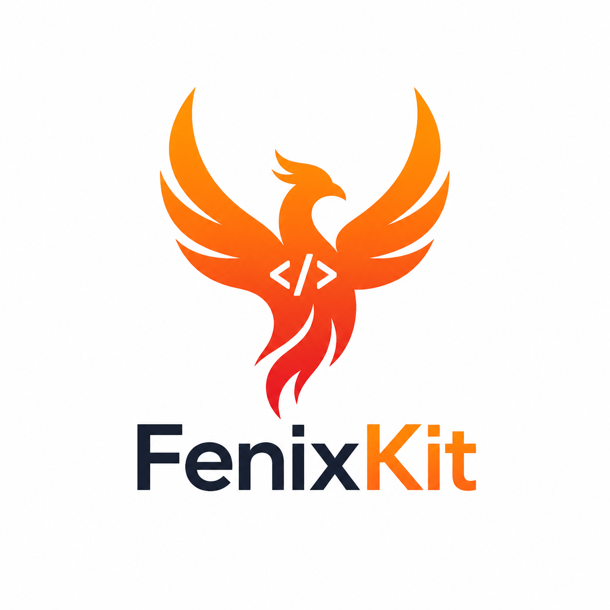

# FenixKit — .NET Minimal API Starter Kit

> **Ship faster. Build smarter.**  
> A MongoDB-backed API template for .NET developers.

Stop rewriting the same boilerplate on every project. FenixKit gives you a solid, scalable foundation — error handling, pagination, repository pattern, Docker, Swagger — all wired up, documented, and ready to extend from day one.


<p align="center">
  <a href="https://fenixkit.dev">
    
  </a>
</p>
<h3 align="center">
  Get it here: <a href="https://fenixkit.dev">fenixkit.dev</a>
</p>

## What's Inside

| Feature | Details |
|---|---|
| **Architecture** | .NET 8 / .NET 10 Minimal API — no controllers, faster startup |
| **Database** | MongoDB with a full abstraction layer |
| **Error handling** | ErrorOr v2 result pattern + RFC 7807 ProblemDetails |
| **Pagination** | Offset-based and cursor-based, both included |
| **Repository** | `BaseRepository` with 7 overridable hooks |
| **Observability** | Health checks, X-Response-Time header |
| **API Docs** | Full Swagger/OpenAPI with XML doc comments |
| **Infrastructure** | Multi-stage Dockerfile + Docker Compose |

---

## Why Not Start from Scratch?

Every new .NET API project faces the same decisions: how to structure routes, how to handle validation errors consistently, how to abstract the database, how to paginate efficiently. Getting these wrong early means painful refactors later.

| Starting from scratch | Using FenixKit |
|---|---|
| 2–5 days wiring project structure | Configure connection string, run |
| Roll your own error-handling strategy | ErrorOr v2 result pattern wired in from day 1 |
| Write MongoDB boilerplate per collection | Generic `IDBRepository` — one interface, all collections |
| Implement pagination, debug edge cases | Offset + cursor-based pagination included |
| Copy-paste logic across repositories | 7 virtual hooks — extend CRUD without rewriting it |
| Swagger setup as an afterthought | Full OpenAPI with XML doc comments from the start |
| Docker setup varies per developer | Dockerfile + Docker Compose ready to go |

---

## Project Structure

```
MyApi/
├── Common/
│   └── Models/          # PagedResult<T>, CursorPagedResult<T>
├── Database/
│   └── Persistence/     # IDBRepository + MongoRepository
├── Domain/
│   ├── Entities/        # BaseEntity, ICollectionEntity, Product
│   ├── Requests/        # ICreateRequest<T>, IUpdateRequest<T>, DTOs
│   └── Responses/       # SummaryResponse, DetailResponse
├── Endpoints/           # ProductEndpoints (Minimal API route groups)
├── Errors/              # ErrorOrExtensions, ProductErrors, PageErrors
├── HealthChecks/        # Liveness + readiness probes
├── Middleware/          # X-Response-Time, GlobalExceptionHandler
├── Repositories/
│   ├── Base/            # IBaseRepository, BaseRepository (7 hooks)
│   └── ProductRepository
├── Program.cs
├── docker-compose.yml
└── Dockerfile
```

---

## Architecture

### Minimal API — No Controllers

Routes are declared as static methods grouped under `MapGroup`, keeping all routes for a resource co-located in one file. Less ceremony, faster startup, zero reflection overhead from controller discovery.

```csharp
public static class ProductEndpoints
{
    public static void MapProductEndpoints(this WebApplication app)
    {
        var group = app.MapGroup("/api/products").WithTags("Products");

        group.MapPost("list/",       GetAll);        // offset pagination
        group.MapPost("listcursor/", GetAllCursor);  // cursor pagination
        group.MapGet("/{id}",        GetById);
        group.MapPost("/",           Create);
        group.MapPut("/",            Update);
        group.MapDelete("/{id}",     Delete);
    }
}
```

### MongoDB Abstraction Layer

`IDBRepository` is the single interface all repositories talk to. It hides the MongoDB driver completely.

| Method | Description |
|---|---|
| `GetByIdAsync<T>` | Fetch a single document by ObjectId |
| `GetPagedAsync<T>` | Offset pagination with TotalCount and TotalPages |
| `GetPagedByCursorAsync<T>` | Cursor pagination using the `_id` index — O(log n) |
| `FindAsync<T>` | Filter documents by any predicate expression |
| `ExistsAsync<T>` | Check existence without fetching the full document |
| `CreateAsync<T>` | Insert a document and return the created entity |
| `UpdateAsync<T>` | Replace an existing document by Id |
| `DeleteAsync<T>` | Remove a document by Id |

---

## The ErrorOr Result Pattern

Every repository method returns `ErrorOr<T>` instead of throwing exceptions for domain errors. The caller always receives either a value or a list of typed errors — no try/catch needed, no accidentally swallowed exceptions.

```csharp
// In the endpoint handler — one line, all cases handled
var result = await repo.GetByIdAsync(id, ct);

return result.Match(
    product => Results.Ok(product),
    errors  => errors.ToResponse()); // → RFC 7807 ProblemDetails
```

Domain errors are typed and centralised:

```csharp
public static class ProductErrors
{
    public static Error NotFound(string id) =>
        Error.NotFound("Product.NotFound", $"No product with id '{id}' was found.");

    public static Error NameConflict(string name) =>
        Error.Conflict("Product.NameConflict", $"A product named '{name}' already exists.");

    public static readonly Error InvalidPrice =
        Error.Validation("Product.InvalidPrice", "Price must be greater than zero.");
}
```

**HTTP mapping is automatic** — no switch statements in endpoint handlers:

| ErrorOr type | HTTP Status |
|---|---|
| `Error.Validation` | 400 Bad Request |
| `Error.NotFound` | 404 Not Found |
| `Error.Conflict` | 409 Conflict |
| `Error.Unexpected` | 500 Internal Server Error |

---

## The BaseRepository Hook System

`BaseRepository` is the centrepiece of the kit. It implements all CRUD operations and exposes **7 virtual hook methods** that you override to inject domain logic — without touching the CRUD algorithm itself.

> **Template Method Pattern** — the base class defines the algorithm: validate → map → persist → project. You override only the steps your domain needs. You never rewrite CRUD.

### The Seven Hooks

| Hook | Called by | Purpose |
|---|---|---|
| `OnValidateCreateAsync` | `CreateAsync` | Validate before touching the database |
| `OnValidateUpdateAsync` | `UpdateAsync` | Validate after enrichment — sees final entity |
| `OnValidateDeleteAsync` | `DeleteAsync` | Block deletion if business rules require it |
| `OnMapCreateAsync` | `CreateAsync` | Set server-computed fields; abort before DB insert |
| `OnMapUpdateAsync` | `UpdateAsync` | Recompute derived fields; abort before validation |
| `OnMapToSummaryAsync` | `GetPagedAsync`, `GetPagedByCursorAsync` | Project entity → lightweight list DTO |
| `OnMapToDetailAsync` | `GetByIdAsync`, `CreateAsync` | Project entity → full detail DTO |

### Hook Execution Order — CreateAsync

```
1. OnValidateCreateAsync  — validate price, category, name uniqueness
2. ICreateRequest<T>.ToDBEntity()  — base field mapping
3. OnMapCreateAsync  — server computes Slug; abort here to skip DB insert
4. IDBRepository.CreateAsync  — database insert
5. OnMapToDetailAsync  — map to ProductDetailResponse, add FormattedPrice
6. 201 Created returned to client
```

### Real-World Hook Examples

**Server-side computed field — Slug**

```csharp
protected override Task<ErrorOr<Product>> OnMapCreateAsync(
    ProductCreateRequest request, Product entity, CancellationToken ct = default)
{
    // Derived from name — never accepted from the client
    entity.Slug = ToSlug(request.Name);
    return Task.FromResult<ErrorOr<Product>>(entity);
}

protected override Task<ErrorOr<Product>> OnMapUpdateAsync(
    ProductUpdateRequest request, Product original, Product entity, CancellationToken ct = default)
{
    entity.Slug = request.Name != original.Name
        ? ToSlug(request.Name)  // recompute if name changed
        : original.Slug;        // preserve if name unchanged
    return Task.FromResult<ErrorOr<Product>>(entity);
}
```

**Presentation-only computed field — FormattedPrice**

```csharp
protected override Task<ErrorOr<ProductDetailResponse>> OnMapToDetailAsync(
    Product entity, CancellationToken ct = default)
{
    var response = ProductDetailResponse.From(entity);
    // Computed at response time — not stored in MongoDB
    response.FormattedPrice = $"€{entity.Price:F2}";
    return Task.FromResult<ErrorOr<ProductDetailResponse>>(response);
}
```

Because `FormattedPrice` is never stored in MongoDB, changing currency, locale, or applying a discount tier requires no database migration — just update the hook.

---

## Summary / Detail Response Split

Returning the same large DTO for both list and single-item endpoints wastes bandwidth. `BaseRepository` enforces a two-projection architecture:

| Endpoint | Response Type | Fields |
|---|---|---|
| `POST /api/products/list/` | `ProductSummaryResponse` | Id, Name, Category, Price |
| `POST /api/products/listcursor/` | `ProductSummaryResponse` | Id, Name, Category, Price |
| `GET /api/products/{id}` | `ProductDetailResponse` | All fields + Slug + FormattedPrice |
| `POST /api/products/` | `ProductDetailResponse` | All fields + Slug + FormattedPrice |

Both DTOs are fully decoupled from the MongoDB document. Internal schema changes don't break your API contract — only the `From()` factory method changes.

---

## Pagination

### Offset-Based Pagination

Classic `page + pageSize` pagination. Returns `TotalCount` and `TotalPages` so the client can render a numbered page navigator. Best for admin dashboards and backoffice UIs.

```json
// POST /api/products/list/
{ "page": 2, "pageSize": 20 }

// Response
{
  "items": [...],
  "page": 2,
  "pageSize": 20,
  "totalCount": 87,
  "totalPages": 5
}
```

### Cursor-Based Pagination

Uses the MongoDB `_id` B-tree index directly. Instead of `Skip(N)` (which scans all preceding documents), the query filters `_id > cursor` — an **O(log n) indexed range scan** regardless of collection size. No duplicate items when documents are inserted between page loads.

```json
// POST /api/products/listcursor/
{ "cursor": "6641f3a2b1c2d3e4f5a6b7c8", "pageSize": 20, "forward": true }

// Response
{
  "items": [...],
  "nextCursor": "6641f3a2b1c2d3e4f5a6b7c8",
  "prevCursor": "6641f3a2b1c2d3e4f5a6b7c1",
  "hasNext": true,
  "hasPrev": false
}
```

| | Offset | Cursor |
|---|---|---|
| Jump to any page | ✅ | ❌ |
| TotalCount available | ✅ | ❌ |
| Consistent under concurrent writes | ❌ | ✅ |
| Performance on large collections | O(n) skip | O(log n) always |
| Best for | Admin UIs | Feeds, infinite scroll |

You don't have to choose upfront — both are included and you pick the right one per endpoint.

---

## Error Handling

### RFC 7807 Problem Details on every error

All error responses are serialised as standard `ProblemDetails` JSON. Clients receive a consistent `type`, `title`, `status`, and `detail` on every error:

```json
// 404 Not Found
{
  "status": 404,
  "title": "Product.NotFound",
  "detail": "No product with id '6638f1a2b3c4d5e6f7a8b9c0' was found.",
  "traceId": "0HN5KQVJQVJQVJQV"
}

// 422 Validation — all errors returned at once
{
  "status": 422,
  "errors": {
    "Product.InvalidPrice": ["Price must be greater than zero."],
    "Product.InvalidCategory": ["Category cannot be empty."]
  }
}
```

### Global Exception Handler

Unhandled exceptions are caught by `GlobalExceptionHandler` and serialised as `500 Internal Server Error ProblemDetails` — clients always receive consistent JSON, never an HTML error page or a raw stack trace. A `traceId` is included for log correlation.

---

## Observability & Infrastructure

### Health Checks

```
GET /health/live   → Liveness probe  — is the process alive?
GET /health/ready  → Readiness probe — is MongoDB reachable?
```

Responses are structured JSON:

```json
{
  "status": "Healthy",
  "duration": "00:00:00.0042310",
  "entries": {
    "mongodb": { "status": "Healthy", "duration": "00:00:00.0041120" }
  }
}
```

### X-Response-Time Header

Every response includes an `X-Response-Time` header measured with `Stopwatch.GetTimestamp()` — high-resolution, no heap allocation. Useful for API gateway dashboards and frontend performance monitoring.

### Docker

```bash
docker compose up --build

# API      → http://localhost:8081
# Swagger  → http://localhost:8081/swagger
# MongoDB  → localhost:27018
```

---

## Adding a New Entity

Adding a new resource follows the same pattern every time. `BaseRepository` is never modified.

```
1. Domain/Entities/Order.cs          — inherits BaseEntity, implements ICollectionEntity
2. Domain/Requests/Orders/           — OrderCreateRequest, OrderUpdateRequest
3. Domain/Responses/Orders/          — OrderSummaryResponse, OrderDetailResponse
4. Repositories/IOrderRepository.cs  — extends IBaseRepository<Order, ...>
5. Repositories/OrderRepository.cs   — extends BaseRepository<Order, ...>, override hooks
6. Endpoints/OrderEndpoints.cs       — register in Program.cs
7. Errors/OrderErrors.cs             — typed domain errors for Order
```

Custom domain queries that don't fit standard CRUD are added directly to the concrete repository — the underlying `IDBRepository` is always accessible:

```csharp
public async Task<ErrorOr<List<OrderSummaryResponse>>> GetByCustomerAsync(
    string customerId, CancellationToken ct = default)
{
    var results = await _Repository.FindAsync<Order>(o => o.CustomerId == customerId, ct);
    if (results.IsError) return results.Errors;

    var summaries = new List<OrderSummaryResponse>();
    foreach (var entity in results.Value)
    {
        var mapped = await OnMapToSummaryAsync(entity, ct);
        if (mapped.IsError) return mapped.Errors;
        summaries.Add(mapped.Value);
    }
    return summaries;
}
```

---

## Getting Started

### Prerequisites

| Requirement | Minimum |
|---|---|
| .NET SDK | 8.0 LTS or 10.0 |
| MongoDB | 6.x+ (or use Docker Compose) |
| Docker Desktop | 4.x (optional) |

### Setup

```bash
# 1. Unzip the template
# 2. Configure your connection string in appsettings.json
# 3. Restore packages
dotnet restore

# 4. Run locally
dotnet run

# — or with Docker —
docker compose up --build
```

### First Run Checklist

- `GET /health/live` returns `{ "status": "Healthy" }`
- `GET /health/ready` returns `Healthy` with a `mongodb` entry
- `POST /api/products/` with a valid body returns `FormattedPrice` and `Slug`
- `POST /api/products/list/` returns paged results with `totalCount`
- `POST /api/products/listcursor/` returns cursor results with `nextCursor`
- `GET /api/products/{id}` with a non-existent ID returns `404 ProblemDetails`
- `POST /api/products/` with a duplicate name returns `409 ProblemDetails`

Once the checklist passes, rename or delete the Product files and replace them with your own domain entities. `BaseRepository`, `IDBRepository`, and all infrastructure code stays exactly as it is.

---

## Technologies

| Package | Role |
|---|---|
| .NET 8 LTS (C# 12) · .NET 10 (C# 14) | Runtime, SDK and language |
| MongoDB.Driver | Official MongoDB .NET driver |
| ErrorOr v2 | Result pattern — no exceptions for domain errors |
| Swashbuckle.AspNetCore | Swagger UI and OpenAPI spec generation |
| Microsoft.Extensions.Diagnostics.HealthChecks | Liveness and readiness probe infrastructure |
| Docker + Docker Compose | API + MongoDB in one command |

---

## License

FenixKit is a commercial product. Each purchase grants a lifetime licence for unlimited personal and commercial projects.

👉 **[fenixkit.dev](https://fenixkit.dev)**
